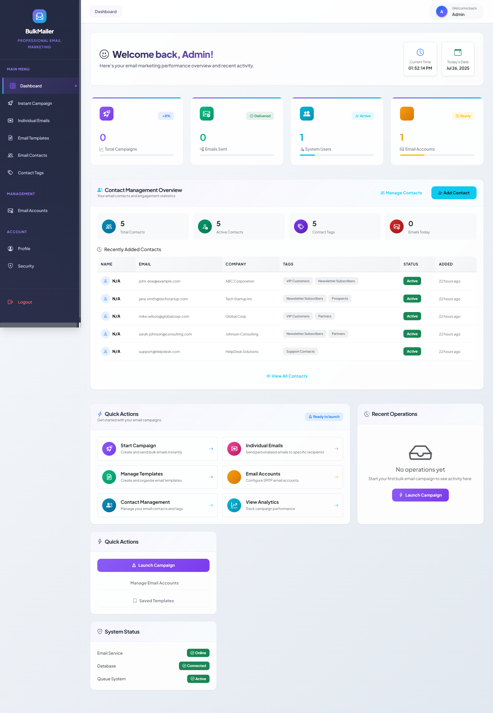
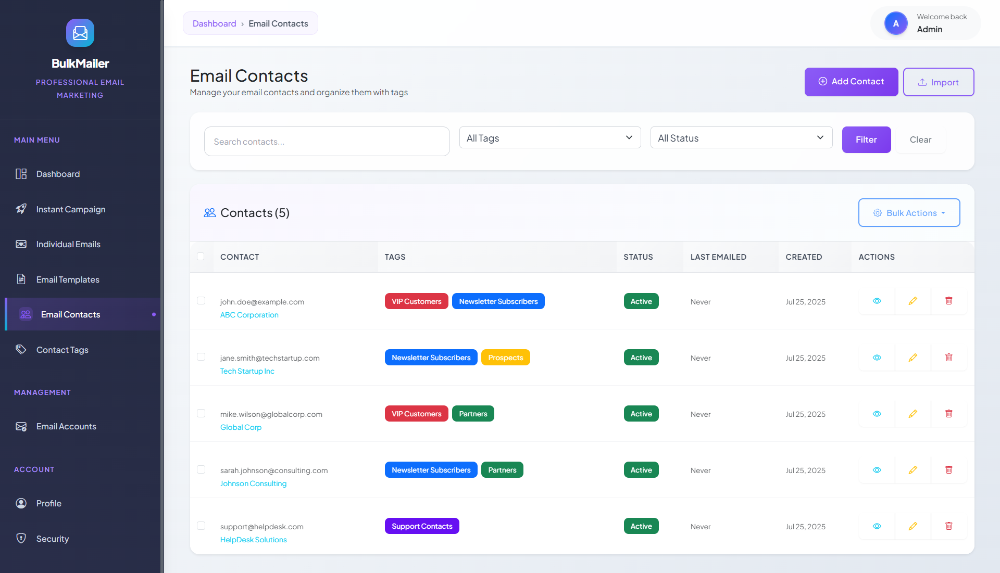
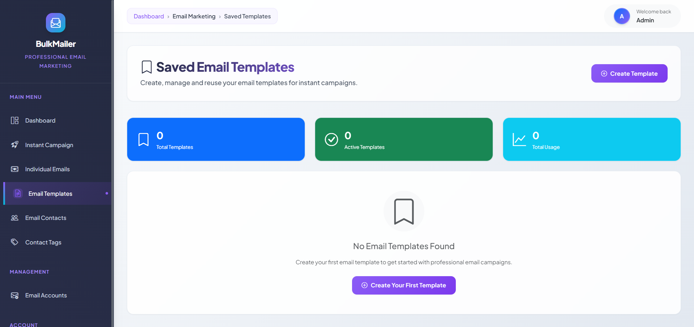
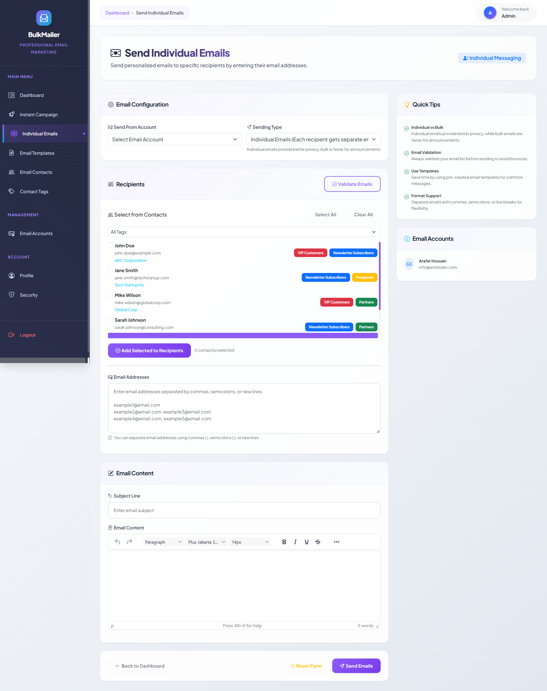
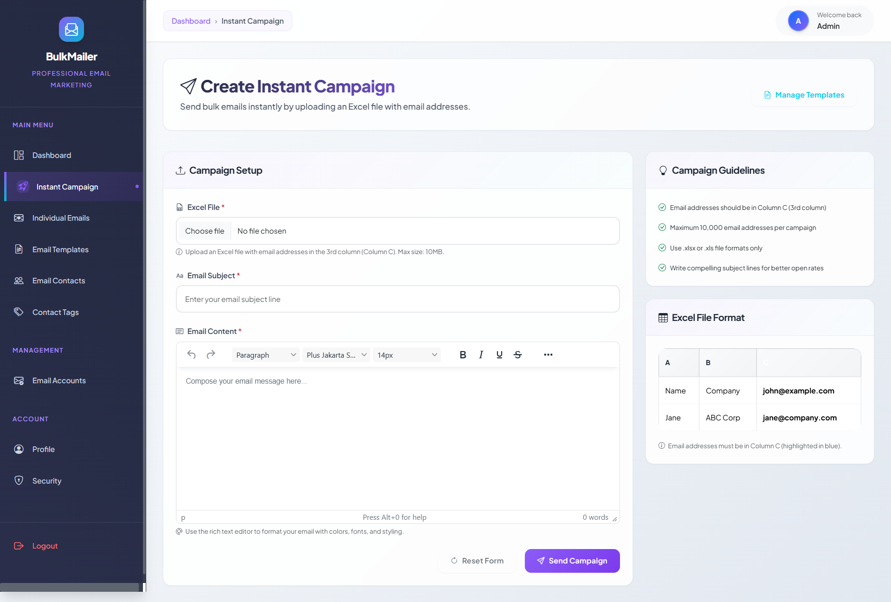
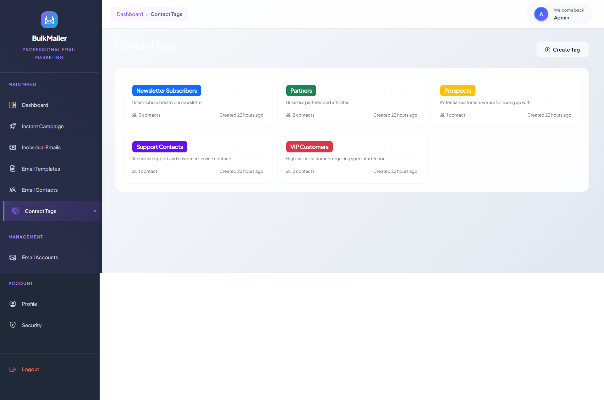
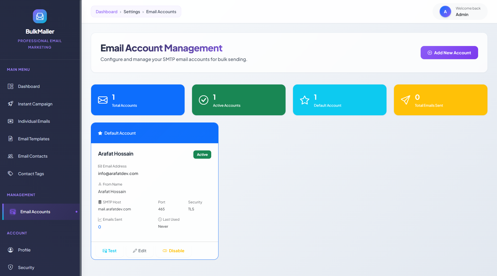
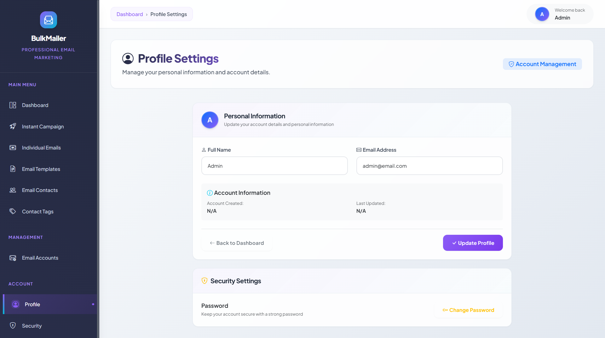
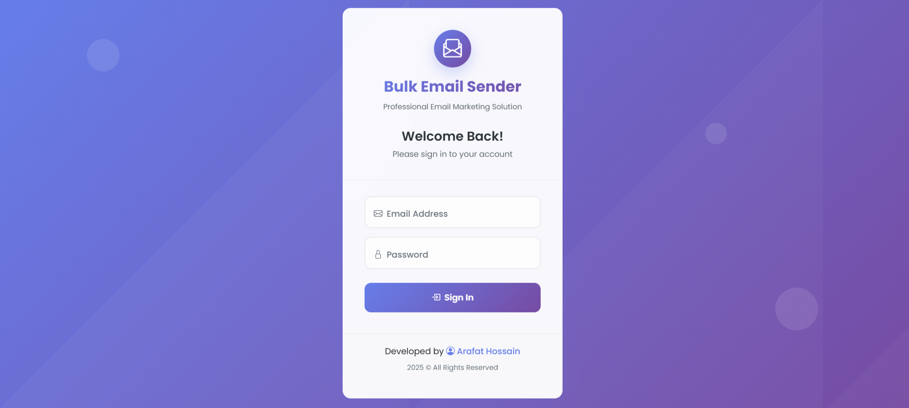

<div align="center">
  
<svg width="120" height="120" viewBox="0 0 120 120">
  <defs>
    <linearGradient id="logoGradient" x1="0%" y1="0%" x2="100%" y2="100%">
      <stop offset="0%" style="stop-color:#667eea;stop-opacity:1" />
      <stop offset="100%" style="stop-color:#764ba2;stop-opacity:1" />
    </linearGradient>
  </defs>
  <circle cx="60" cy="60" r="55" fill="url(#logoGradient)"/>
  <rect x="30" y="42" width="60" height="36" rx="6" fill="white" opacity="0.95"/>
  <path d="M30 48 L60 65 L90 48" stroke="url(#logoGradient)" stroke-width="2" fill="none" stroke-linecap="round"/>
  <circle cx="85" cy="35" r="2" fill="white" opacity="0.8"/>
  <circle cx="90" cy="30" r="1.5" fill="white" opacity="0.6"/>
  <circle cx="95" cy="35" r="1" fill="white" opacity="0.4"/>
</svg>
  
  <h1>🚀 Bulk Email Sender v2.0</h1>
  
  <p><strong>Professional Laravel-based email marketing solution with advanced contact management</strong></p>
  
  <p>
    
    
    
    
  </p>
  
  <p>
    
    
    
  </p>
</div>

---

## ✨ Features

**What's New in v2.0:**
- 👥 **Contact Management** - Complete contact database with tags and categories
- 📧 **Individual Emails** - Send personalized emails to specific contacts  
- 🏷️ **Tag System** - Organize and target contacts with custom tags
- 📊 **Excel Import/Export** - Seamlessly import contacts from CSV/Excel files
- 🎨 **Modern UI** - Clean, responsive design with breadcrumb navigation
- � **Queue System** - Background email processing with Laravel Queues

**Core Features:**
- ✅ Bulk email sending with HTML templates
- ✅ Contact management with tagging system
- ✅ Excel/CSV import and export
- ✅ Email validation and verification
- ✅ Multi-SMTP support
- ✅ Real-time delivery tracking

---

## � Screenshots

<div align="center">

### Dashboard Overview


### Contact Management


### Email Templates


### Individual Email Sending


### Instant Campaign


### Tag Management


### Email Accounts Settings


### User Profile


### Login Page


</div>

---

## �🛠️ Prerequisites

- **PHP**: 8.1+
- **Composer**: Latest version
- **Laravel**: 10.x
- **Database**: MySQL 5.7+ or PostgreSQL 10+
- **SMTP Server**: Gmail, SendGrid, Mailgun, etc.

---

## ⚡ Installation

1. **Clone and setup**
   ```bash
   git clone https://github.com/arafat-web/Bulk-Email-Sender.git
   cd Bulk-Email-Sender
   composer install
   cp .env.example .env
   php artisan key:generate
   ```

2. **Database setup**
   ```bash
   # Configure database in .env file
   php artisan migrate --seed
   ```

3. **Email configuration in .env**
   ```env
   MAIL_MAILER=smtp
   MAIL_HOST=smtp.gmail.com
   MAIL_PORT=587
   MAIL_USERNAME=your-email@gmail.com
   MAIL_PASSWORD=your-app-password
   MAIL_ENCRYPTION=tls
   ```

4. **Start application**
   ```bash
   php artisan serve
   php artisan queue:work
   ```

**Default Login:** `admin@email.com` / `12345678`

---

## 📸 Screenshots

<div align="center">
  
  
</div>

<div align="center">
  
  
</div>

---

## 🎮 How to Use

### 📧 **Bulk Email Campaign**
1. Navigate to "Instant Campaign"
2. Import contacts via CSV/Excel or use existing contacts
3. Write your email subject and content
4. Send to all contacts or specific tags

### 👥 **Contact Management**
1. Go to "Contacts" → "Add Contact" for individual entries
2. Use "Import Contacts" for bulk CSV/Excel uploads
3. Organize contacts with tags
4. Export contact lists when needed

### 🏷️ **Tag System**
1. Create tags in "Contact Tags" section  
2. Assign tags to contacts for organization
3. Send targeted emails to specific tag groups
4. Filter contacts by tags for better management

---

## 🤝 Contributing

1. Fork the repository
2. Create your feature branch (`git checkout -b feature/amazing-feature`)
3. Commit your changes (`git commit -m 'Add amazing feature'`)
4. Push to the branch (`git push origin feature/amazing-feature`)
5. Open a Pull Request

For issues and feature requests, use [GitHub Issues](https://github.com/arafat-web/Bulk-Email-Sender/issues).

---

## 📜 License

This project is licensed under the MIT License - see the [LICENSE](LICENSE) file for details.

---

## 📱 Connect With Me

<div align="center">
  
[](mailto:arafat.122260@gmail.com)
[](https://www.facebook.com/arafathossain000)
[](https://www.linkedin.com/in/arafat-hossain-ar-a174b51a6/)
[](https://arafatdev.com)

</div>

---

<div align="center">
  <p><strong>⭐ If you found this project helpful, please give it a star! ⭐</strong></p>
  <p>Made with ❤️ by <a href="https://github.com/arafat-web">Arafat Hossain</a></p>
</div>
