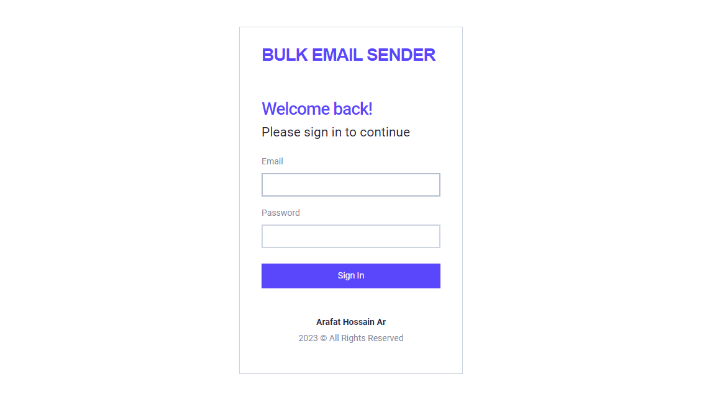
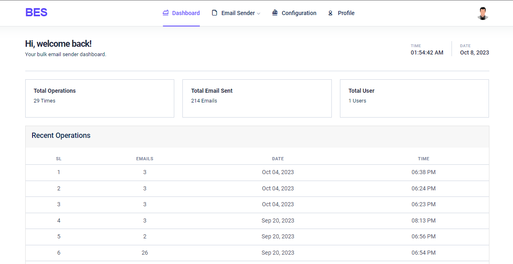
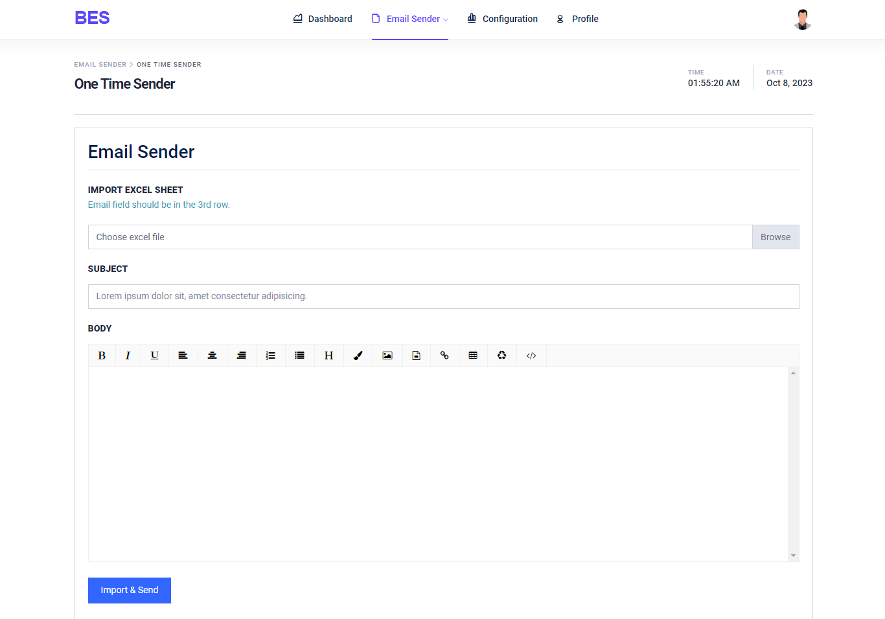

<div align="center">
  
  
  <h1>🚀 Bulk Email Sender v2.0</h1>
  
  <p><strong>Professional Laravel-based email marketing solution with advanced contact management</strong></p>
  
  <p>
    
    
    
    
  </p>
  
  <p>
    
    
    
  </p>
</div>

---

## 📋 Table of Contents

- [🌟 What's New in v2.0](#-whats-new-in-v20)
- [✨ Features](#-features)
- [🎯 Use Cases](#-use-cases)
- [🛠️ Prerequisites](#️-prerequisites)
- [⚡ Quick Start](#-quick-start)
- [📸 Screenshots](#-screenshots)
- [🎮 Usage Guide](#-usage-guide)
- [🔧 Configuration](#-configuration)
- [🚀 Deployment](#-deployment)
- [🤝 Contributing](#-contributing)
- [📞 Support](#-support)

---

## 🌟 What's New in v2.0


Version 2.0 brings revolutionary improvements and enterprise-grade features:

### 🎯 **Contact Management System**
- **Smart Contact Organization**: Organize contacts with tags and categories
- **Excel Import/Export**: Seamlessly import contacts from CSV/Excel files
- **Duplicate Detection**: Automatic duplicate email detection and management
- **Contact Profiles**: Detailed contact information with custom fields

### 📧 **Advanced Email Features**
- **Individual Email Campaigns**: Send personalized emails to specific contacts
- **Template Library**: Save and reuse email templates
- **Rich Text Editor**: Professional WYSIWYG editor with media support
- **Email Tracking**: Track delivery status and engagement metrics

### 🏷️ **Tag-Based Targeting**
- **Dynamic Tags**: Create and manage contact tags for precise targeting
- **Bulk Tagging**: Apply tags to multiple contacts simultaneously
- **Tag-Based Campaigns**: Send emails to specific tag groups
- **Smart Filtering**: Advanced contact filtering by tags and attributes

### 🎨 **Enhanced User Experience**
- **Modern UI/UX**: Clean, responsive design with intuitive navigation
- **Dark Mode Support**: Professional dark theme option
- **Mobile Responsive**: Optimized for all device sizes
- **Breadcrumb Navigation**: Easy navigation with contextual breadcrumbs

---

## ✨ Features

### 📊 **Core Features**
- ✅ **Bulk Email Sending** - Send thousands of emails efficiently
- ✅ **Contact Management** - Complete contact database management
- ✅ **Excel Integration** - Import/export contacts via Excel/CSV
- ✅ **Tag System** - Organize contacts with custom tags
- ✅ **Template Engine** - Create and save reusable email templates
- ✅ **Queue System** - Background email processing with Laravel Queues

### 🔧 **Technical Features**
- ✅ **Laravel 10.x** - Built on the latest Laravel framework
- ✅ **MySQL Database** - Robust data storage and management
- ✅ **Bootstrap UI** - Modern, responsive user interface
- ✅ **Email Validation** - Advanced email validation and verification
- ✅ **Error Handling** - Comprehensive error tracking and logging
- ✅ **Security** - CSRF protection and secure authentication

### 📈 **Advanced Features**
- ✅ **Multi-SMTP Support** - Configure multiple email providers
- ✅ **Delivery Tracking** - Monitor email delivery status
- ✅ **Campaign Analytics** - Track campaign performance metrics
- ✅ **Scheduled Sending** - Schedule emails for future delivery
- ✅ **Rate Limiting** - Control email sending rate to avoid spam filters
- ✅ **Backup & Export** - Export data for backup and migration

---

## 🎯 Use Cases


### 📢 **Marketing Campaigns**
- Newsletter distribution to subscribers
- Promotional offers and announcements
- Product launch notifications
- Event invitations and reminders

### 🏢 **Business Communications**
- Internal company announcements
- Customer service updates
- Invoice and billing notifications
- Survey and feedback requests

### 🎓 **Educational Institutions**
- Student notifications and updates
- Parent-teacher communications
- Event announcements
- Academic schedule updates

### 🏪 **E-commerce**
- Order confirmations and updates
- Abandoned cart reminders
- Customer loyalty programs
- Seasonal promotions

---

## 🛠️ Prerequisites

Before installing Bulk Email Sender v2.0, ensure your system meets these requirements:

### 📋 **System Requirements**
- **PHP**: 8.1 or higher
- **Composer**: Latest version
- **Laravel**: 10.x
- **Database**: MySQL 5.7+ or PostgreSQL 10+
- **Node.js**: 16+ (for asset compilation)
- **Memory**: 512MB minimum (2GB recommended)

### 🔧 **PHP Extensions**
```bash
php-mbstring, php-xml, php-curl, php-zip, php-intl, php-gd
```

### 📧 **Email Configuration**
- SMTP server credentials (Gmail, SendGrid, Mailgun, etc.)
- Valid sender email address
- Appropriate sending limits from your email provider

---

## ⚡ Quick Start

### 🚀 **Installation**

1. **Clone the Repository**
   ```bash
   git clone https://github.com/arafat-web/Bulk-Email-Sender.git
   cd Bulk-Email-Sender
   ```

2. **Install PHP Dependencies**
   ```bash
   composer install
   ```

3. **Install Node Dependencies**
   ```bash
   npm install && npm run build
   ```

4. **Environment Setup**
   ```bash
   cp .env.example .env
   php artisan key:generate
   ```

5. **Database Configuration**
   ```bash
   # Configure your database in .env file
   DB_CONNECTION=mysql
   DB_HOST=127.0.0.1
   DB_PORT=3306
   DB_DATABASE=bulk_email_sender
   DB_USERNAME=your_username
   DB_PASSWORD=your_password
   ```

6. **Run Migrations**
   ```bash
   php artisan migrate --seed
   ```

7. **Start the Application**
   ```bash
   php artisan serve
   php artisan queue:work
   ```

### 🔑 **Default Login Credentials**
```
Email: admin@email.com
Password: 12345678
```

---

## 📸 Screenshots

### 🏠 **Dashboard Overview**


### 📧 **Bulk Email Sender**


### 👥 **Contact Management**


### 🏷️ **Tag Management**


### 📊 **Import Contacts**


### ✉️ **Individual Email**


### ⚙️ **Email Settings**


### 📱 **Mobile Responsive**
<div align="center">
  
  
  
</div>

---

## 🎮 Usage Guide

### 📧 **Sending Bulk Emails**

1. **Navigate to One Time Sender**
   - Click on "One Time Sender" in the sidebar
   - Enter your email subject
   - Compose your message using the rich text editor

2. **Import Contacts**
   - Go to "Contacts" → "Import Contacts"
   - Upload your CSV/Excel file with email addresses
   - Map the columns to contact fields
   - Review and import

3. **Send Campaign**
   - Select your target audience (all contacts or specific tags)
   - Preview your email
   - Click "Send" to queue the emails

### 👥 **Managing Contacts**

1. **Add Individual Contacts**
   - Go to "Contacts" → "Add Contact"
   - Fill in contact information
   - Assign tags for organization

2. **Bulk Import**
   - Use "Import Contacts" for CSV/Excel uploads
   - Sample CSV format:
     ```csv
     name,email,phone,company
     John Doe,john@example.com,+1234567890,ABC Corp
     Jane Smith,jane@example.com,+0987654321,XYZ Inc
     ```

3. **Tag Management**
   - Create tags for better organization
   - Apply tags to contacts for targeted campaigns
   - Use tags to filter and segment your audience

### ✉️ **Individual Email Campaigns**

1. **Select Recipients**
   - Go to "Individual Emails" → "Create"
   - Choose specific contacts or tag groups
   - Verify recipient list

2. **Compose Email**
   - Write personalized subject line
   - Use rich text editor for content
   - Add attachments if needed

3. **Send or Schedule**
   - Send immediately or schedule for later
   - Monitor delivery status in real-time

---

## 🔧 Configuration

### 📧 **Email Settings**

Configure your SMTP settings in `.env`:

```env
MAIL_MAILER=smtp
MAIL_HOST=smtp.gmail.com
MAIL_PORT=587
MAIL_USERNAME=your-email@gmail.com
MAIL_PASSWORD=your-app-password
MAIL_ENCRYPTION=tls
MAIL_FROM_ADDRESS=your-email@gmail.com
MAIL_FROM_NAME="${APP_NAME}"
```

### 🔄 **Queue Configuration**

For production environments, use Redis or database queues:

```env
QUEUE_CONNECTION=redis
REDIS_HOST=127.0.0.1
REDIS_PASSWORD=null
REDIS_PORT=6379
```

### 📊 **Performance Optimization**

1. **Enable Caching**
   ```bash
   php artisan config:cache
   php artisan route:cache
   php artisan view:cache
   ```

2. **Optimize Composer**
   ```bash
   composer install --optimize-autoloader --no-dev
   ```

3. **Queue Workers**
   ```bash
   # Use Supervisor for production
   php artisan queue:work --sleep=3 --tries=3 --max-time=3600
   ```

---

## 🚀 Deployment

### 🐳 **Docker Deployment**

1. **Build Docker Image**
   ```bash
   docker build -t bulk-email-sender .
   ```

2. **Run with Docker Compose**
   ```yaml
   version: '3.8'
   services:
     app:
       build: .
       ports:
         - "8000:8000"
       environment:
         - DB_HOST=db
         - DB_DATABASE=bulk_email_sender
       depends_on:
         - db
         - redis
     
     db:
       image: mysql:8.0
       environment:
         MYSQL_DATABASE: bulk_email_sender
         MYSQL_ROOT_PASSWORD: password
     
     redis:
       image: redis:alpine
   ```

### ☁️ **Cloud Deployment**

**AWS Elastic Beanstalk:**
```bash
eb init bulk-email-sender
eb create production
eb deploy
```

**Digital Ocean App Platform:**
```yaml
name: bulk-email-sender
services:
- name: web
  source_dir: /
  github:
    repo: arafat-web/Bulk-Email-Sender
    branch: main
  run_command: php artisan serve --host=0.0.0.0 --port=8080
```

---

## 🤝 Contributing

We welcome contributions! Here's how you can help:

### 🐛 **Bug Reports**
- Use the [issue tracker](https://github.com/arafat-web/Bulk-Email-Sender/issues)
- Provide detailed reproduction steps
- Include system information and logs

### 💡 **Feature Requests**
- Open a feature request issue
- Describe the use case and expected behavior
- Discuss implementation approaches

### 🔧 **Pull Requests**

1. **Fork the Repository**
   ```bash
   git clone https://github.com/YOUR_USERNAME/Bulk-Email-Sender.git
   ```

2. **Create Feature Branch**
   ```bash
   git checkout -b feature/amazing-feature
   ```

3. **Make Changes**
   - Follow PSR-12 coding standards
   - Add tests for new features
   - Update documentation

4. **Submit Pull Request**
   - Provide clear description of changes
   - Reference related issues
   - Ensure all tests pass

### 📋 **Development Guidelines**

- **Code Style**: Follow PSR-12 standards
- **Testing**: Write unit and feature tests
- **Documentation**: Update README and inline docs
- **Commits**: Use conventional commit messages

---

## 📞 Support

### 🆘 **Getting Help**

- **Documentation**: Check this README first
- **Issues**: [GitHub Issues](https://github.com/arafat-web/Bulk-Email-Sender/issues)
- **Discussions**: [GitHub Discussions](https://github.com/arafat-web/Bulk-Email-Sender/discussions)

### 🐛 **Troubleshooting**

**Common Issues:**

1. **Queue not processing**
   ```bash
   php artisan queue:restart
   php artisan queue:work
   ```

2. **Email not sending**
   - Check SMTP configuration
   - Verify firewall settings
   - Test with `php artisan tinker`

3. **Permission errors**
   ```bash
   chmod -R 755 storage bootstrap/cache
   chown -R www-data:www-data storage bootstrap/cache
   ```

### 📈 **Performance Issues**

- Enable Redis caching
- Optimize database queries
- Use queue workers for background processing
- Monitor server resources

---

## 📜 License

This project is licensed under the MIT License - see the [LICENSE](LICENSE) file for details.

---

## 🌟 Acknowledgments

- **Laravel Framework** - The PHP framework that powers this application
- **Bootstrap** - For the responsive UI components
- **Font Awesome** - For the beautiful icons
- **Contributors** - All the amazing people who have contributed to this project

---

## 📱 Connect With Me

<div align="center">
  
[](mailto:arafat.122260@gmail.com)
[](https://www.facebook.com/arafathossain000)
[](https://www.linkedin.com/in/arafat-hossain-ar-a174b51a6/)
[](https://arafatdev.com)

</div>

---

<div align="center">
  <p><strong>⭐ If you found this project helpful, please give it a star! ⭐</strong></p>
  <p>Made with ❤️ by <a href="https://github.com/arafat-web">Arafat Hossain</a></p>
</div>

## Setup Instructions

### Step 1: Clone the Repository
```
git clone https://github.com/arafat-web/bulk-email-sender.git
cd bulk-email-sender
```

### Step 2: Install Dependencies
```bash
composer install
```

### Step 3: Configure Environment Variables
Duplicate the `.env.example` file and rename it to `.env`. Update the following variables:

```ini
DB_CONNECTION=mysql
DB_HOST=your_database_host
DB_PORT=your_database_port
DB_DATABASE=your_database_name
DB_USERNAME=your_database_username
DB_PASSWORD=your_database_password

MAIL_DRIVER=smtp
MAIL_HOST=your_smtp_host
MAIL_PORT=your_smtp_port
MAIL_USERNAME=your_smtp_username
MAIL_PASSWORD=your_smtp_password
MAIL_ENCRYPTION=tls
MAIL_FROM_ADDRESS=your_email@example.com
MAIL_FROM_NAME="${APP_NAME}"
```

### Step 4: Generate Application Key
```bash
php artisan key:generate
```

### Step 5: Run Migrations and Seed Database
```bash
php artisan migrate --seed
```

### Step 6: Start Queue
```bash
php artisan queue:listen
```

### Step 6: Serve the Application
```bash
php artisan serve
```

Access the application in your browser at `http://localhost:8000`.


## How to Use

### 1. One Time Sender
1. Login to the admin panel.
    ```
    Email: admin@email.com
    Password: 12345678
    ```
2. Navigate to the "One Time Sender" section.
3. Enter your email subject in the provided field.
4. Design your email template using the textarea editor.
5. Click the "Send" button.
6. Wait a few minutes. Your emails will be sent one by one to the recipients.

## Demo




## Contributing
For any issues or inquiries, please open an issue on the [Issues](https://github.com/arafat-web/Bulk-Email-Sender/issues).<br/>
If you can help me by contributing. Please don't hesitate to open a [Pull Request](https://github.com/arafat-web/Bulk-Email-Sender/pulls).<br/>
🎉 **Thanks for reading!** 🌟  


### Contact Me
[](mailto:arafat.122260@gmail.com)
[](https://www.facebook.com/arafathossain000)
[](https://www.linkedin.com/in/arafat-hossain-ar-a174b51a6/)
[](https://www.sololearn.com/profile/4703319)
[](https://arafatdev.com)
